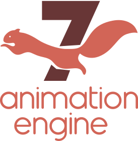

# animationEngine
animationEngine is an animation library for liveCode

  

## What's new in version 7?

- This version is compatible with versions 8 or higher of LiveCode.
- The library can now be installed as an extension to the LiveCode IDE. So now we will have the documentation in the dictionary and the other advantages that this represents.
- The validation process of the parameters of the functions and commands has been optimized.
- Implemented a new way to get and save custom properties that use the library.

### List of handles added or changed in this version of the library.

- ***rectanglesIntersect***(new): function that tells us if two rectangles intersect or not.
- ***aeInfo***(new): As a synonym for the animationEngineInfo() function that already existed in previous versions.
- ***animationEngineVersion***(update): Now this function just returns the version number of the library, without any other information.
- ***aeVersion***(new): An abbreviation or synonym for the above function.

## What is new in version 6?

animationEngine 6 has been optimized to work with liveCode version 6.7 and higher, including, but without warranty the current developer preview of the liveCode 9 engine (which is by the time of this writing version 9.01). One of the most notably changes is one in licensing. animationEngine is now in the Public Domain!

## Licensing terms:
animationEngine is set free into the Public Domain. The Software is provided "as is" with no warranty.

## Availability of source code:
You will find the latest sources and documentation on Github.

https://github.com/derbrill/animationEngine

> [!IMPORTANT]
> Finally, thank you for helping out! If you purchased a license for animationEngine, I really appreciate that! It helped moving the library forward!
